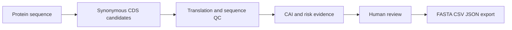
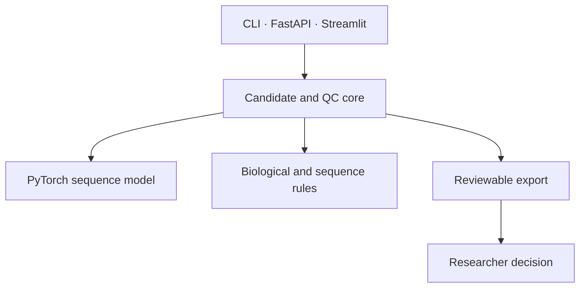

# PichiaCLM

[English](README.md) · [中文](README.zh.md) · [日本語](README.ja.md) · [한국어](README.ko.md)

> **Pichia 発現コンストラクトのためのコドン設計ワークベンチ。** タンパク質配列からレビュー可能な同義 CDS 候補を作成しますが、発現量や実験成功を保証しません。

## なぜ重要か

「最適化済み」の DNA 配列を一つだけ返すのではなく、候補、配列品質の根拠、そして人間の判断を残します。DNA 発注前にチームで設計上のトレードオフを確認できます。

## 主な強み

| 設計判断 | 価値 |
| --- | --- |
| 複数候補を提示 | ブラックボックスの単一スコアではなく比較可能な選択肢 |
| 二つの CAI と規則ベース QC | 翻訳、GC、反復、motif、homopolymer、制限酵素部位のリスクを明示 |
| CLI・HTTP・Streamlit が同じコアを利用 | 自動化と UI で結果が一致 |
| 保守的な受入れ規則 | 候補はレビュー入力であり、収量や分泌の証明ではない |

## ワークフロー



## アーキテクチャ境界



UI は結果を表示・転送できますが、候補受入れ規則を再定義してはいけません。CAI はレビュー根拠であり、単独の閾値ではありません。

## クイックスタート

```powershell
pip install -r requirements.txt
python -m streamlit run Model_PichiaCLM/interfaces/streamlit_app.py
```

API は `uvicorn Model_PichiaCLM.interfaces.api:app --host 0.0.0.0 --port 8000` で起動できます。出力は必ず人間が確認します。

## 検証と文書

`python -m pytest -q tests/test_core_features.py tests/test_docs_governance.py` を実行してください。範囲・設計・進捗・引継ぎ・決定はそれぞれ [Requirements](docs/REQUIREMENTS.md)、[Architecture](docs/ARCHITECTURE.md)、[Execution Plan](docs/EXECUTION_PLAN.md)、[Handoff](docs/HANDOFF.md)、[ADR index](docs/adr/README.md) を参照します。

<details><summary>技術面接向け：CAI だけでは不十分な理由</summary>
CAI は比較のための根拠ですが、全ての配列リスクや発現を説明しません。そのため翻訳正確性と配列 QC を受入れ経路に残しています。
</details>

> **考察：** 優れた配列設計は、高価な実験の前に不確実性を検査可能にします。 [Personal site](https://77652189.github.io)
