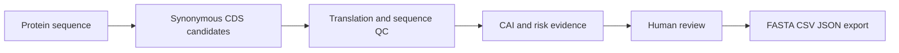
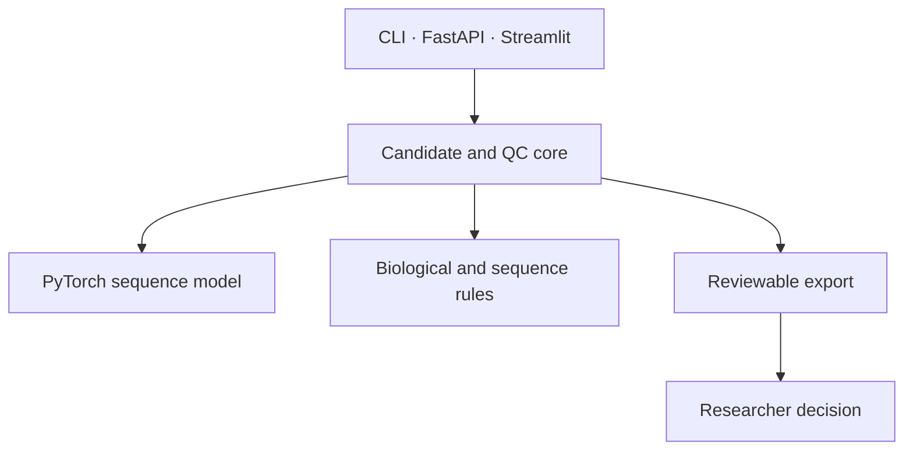

# PichiaCLM

[English](README.md) · [中文](README.zh.md) · [日本語](README.ja.md) · [한국어](README.ko.md)

> **Pichia 발현 구축체를 위한 코돈 설계 워크벤치.** 단백질 서열을 검토 가능한 동의적 CDS 후보로 바꾸지만 발현량이나 실험 성공을 보장하지 않습니다.

## 왜 중요한가

하나의 불투명한 “최적” DNA만 제시하지 않습니다. 후보, 서열 품질 근거, 사람의 판단을 함께 남겨 DNA 주문 전 팀이 설계의 절충점을 검토할 수 있습니다.

## 핵심 강점

| 엔지니어링 결정 | 가치 |
| --- | --- |
| 복수 후보 제공 | 단일 블랙박스 점수 대신 비교 가능한 선택지 |
| 이중 CAI와 규칙 기반 QC | 번역, GC, 반복, motif, homopolymer, 제한효소 부위 위험을 명시 |
| CLI·HTTP·Streamlit의 공통 코어 | 자동화와 UI 결과의 일관성 |
| 보수적 수용 규칙 | 후보는 검토 입력이며 분비·수율·실험 성공의 증거가 아님 |

## 워크플로



## 아키텍처 경계



UI는 결과를 표시하고 전달할 수 있지만 후보 수용 규칙을 바꾸면 안 됩니다. CAI는 검토 근거이지 독립적인 통과 기준이 아닙니다.

## 빠른 시작

```powershell
pip install -r requirements.txt
python -m streamlit run Model_PichiaCLM/interfaces/streamlit_app.py
```

API는 `uvicorn Model_PichiaCLM.interfaces.api:app --host 0.0.0.0 --port 8000`로 실행합니다. 출력물은 반드시 사람이 검토합니다.

## 검증과 문서

`python -m pytest -q tests/test_core_features.py tests/test_docs_governance.py`를 실행합니다. 범위·설계·진행·인수인계·결정은 각각 [Requirements](docs/REQUIREMENTS.md), [Architecture](docs/ARCHITECTURE.md), [Execution Plan](docs/EXECUTION_PLAN.md), [Handoff](docs/HANDOFF.md), [ADR index](docs/adr/README.md)를 참조합니다.

<details><summary>기술 면접: 왜 CAI만 최적화하지 않는가?</summary>
CAI는 비교 근거이지만 모든 서열 위험이나 발현을 설명하지 못합니다. 그래서 번역 정확성과 서열 QC를 수용 경로에 남깁니다.
</details>

> **생각:** 좋은 서열 설계는 비싼 실험 전에 불확실성을 검토 가능하게 만듭니다. [Personal site](https://77652189.github.io)
