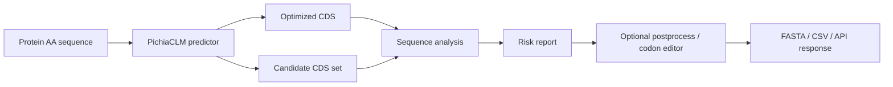
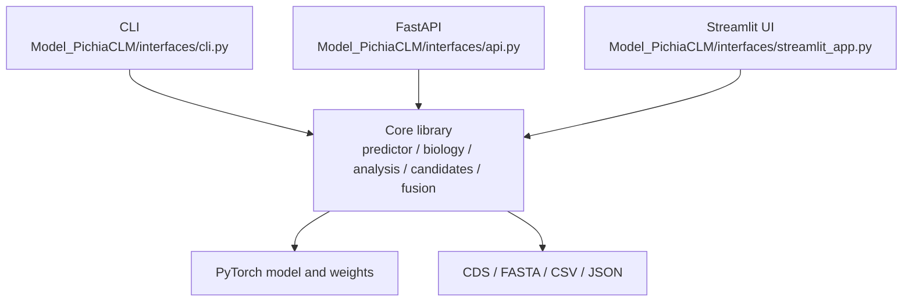

<div align="center">

# PichiaCLM-Torch

**Deployable PyTorch toolkit for Pichia codon optimization, CDS quality control, and construct review**

[](https://www.python.org/)
[](https://pytorch.org/)
[](https://fastapi.tiangolo.com/)
[](https://streamlit.io/)

**Language:** English | [Chinese](README.zh-CN.md)

</div>

---

## Overview

PichiaCLM-Torch converts protein amino-acid sequences into synonymous CDS/DNA candidates for *Pichia pastoris* expression. It wraps the model with practical deployment interfaces and sequence-review tools so optimized CDS outputs can be inspected before cloning, synthesis, or experiment planning.

```text
amino-acid sequence -> optimized Pichia CDS -> quality report -> construct-ready review table
```

This project does not design new proteins and does not predict expression yield. It optimizes codon choices and highlights sequence risks that should be reviewed before wet-lab use.

## What It Does

| Area | Current capability |
|---|---|
| Model inference | PyTorch AA-to-CDS prediction using bundled PichiaCLM weights |
| Batch processing | FASTA batch prediction for multiple proteins, variants, or construct candidates |
| Candidate generation | Generate multiple CDS candidates, compare diversity, and select lower-similarity subsets |
| CDS quality control | Analyze model outputs or externally optimized CDS without rerunning prediction |
| Sequence checks | Translation consistency, internal stop codons, GC/local GC, CAI, codon usage, rare codon runs, homopolymers, repeats, motifs, and restriction sites |
| Construct review | Compare whole-sequence versus segmented signal peptide + mature protein optimization |
| Post-processing | Conservative synonymous edits for selected restriction sites, motifs, homopolymers, high local GC, and repeated fragments |
| Interfaces | CLI, FastAPI, and Streamlit UI over the same core predictor |

## Workflow



In the broader Pichia expression-design workflow, SigScout can provide signal peptide candidates and P-PromOpt can provide promoter candidates; PichiaCLM focuses on the CDS layer.

## Architecture



| Layer | Key path | Responsibility |
|---|---|---|
| Core | [`Model_PichiaCLM/core/`](Model_PichiaCLM/core/) | Model loading, biological utilities, CDS analysis, restriction scanning, candidates, fusion comparison, and post-processing |
| Interfaces | [`Model_PichiaCLM/interfaces/`](Model_PichiaCLM/interfaces/) | CLI, FastAPI, and Streamlit adapters |
| Model files | [`Model_PichiaCLM/Training/`](Model_PichiaCLM/Training/) | Training notebooks, datasets, metrics, and bundled weights |
| Tests | [`tests/test_core_features.py`](tests/test_core_features.py) | Focused checks for biology utilities, FASTA, analysis, postprocess, fusion, and candidates |

Deployment details are documented in [Deployment](DEPLOYMENT.md).

## Quick Start

Install the dependency set you need:

```powershell
pip install -r requirements-core.txt       # core inference only
pip install -r requirements-api.txt        # FastAPI
pip install -r requirements-streamlit.txt  # Streamlit UI
pip install -r requirements-deploy.txt     # API + UI
```

### CLI

Single prediction:

```powershell
python -m Model_PichiaCLM.interfaces.cli --aa MSTNPKPQR --json
```

Batch FASTA prediction:

```powershell
python -m Model_PichiaCLM.interfaces.cli `
  --aa-fasta input.fasta `
  --analysis `
  --out-fasta output_cds.fasta `
  --out-csv report.csv
```

Analyze an externally optimized CDS:

```powershell
python -m Model_PichiaCLM.interfaces.cli `
  --cds ATGTCCACAAATCCCAAACCACAGAGA `
  --expected-aa MSTNPKPQR `
  --analysis
```

### FastAPI

```powershell
uvicorn Model_PichiaCLM.interfaces.api:app --host 0.0.0.0 --port 8000
```

Example request:

```powershell
Invoke-RestMethod -Method Post `
  -Uri http://127.0.0.1:8000/predict `
  -ContentType application/json `
  -Body '{"amino_acids":"MSTNPKPQR"}'
```

Available endpoints include:

| Endpoint | Purpose |
|---|---|
| `GET /health` | Service health |
| `POST /predict` | Single AA-to-CDS prediction |
| `POST /predict_batch` | Batch AA-to-CDS prediction |
| `POST /predict_candidates` | Multiple candidate CDS generation |
| `POST /analyze_cds` | External CDS quality control |
| `POST /analyze_cds_batch` | Batch external CDS quality control |

### Streamlit

```powershell
python -m streamlit run Model_PichiaCLM/interfaces/streamlit_app.py `
  --server.address 0.0.0.0 `
  --server.port 8501
```

Open:

```text
http://127.0.0.1:8501
```

The UI includes single prediction, candidate CDS generation, codon editor, FASTA batch prediction, external CDS QC, and signal peptide / mature protein fusion comparison.

## Model Weights

Default weights path:

```text
Model_PichiaCLM/Training/PichiaData/2Target_AllData/Arch1-0404.weights.pt
```

Override it for API mode:

```powershell
$env:PICHIA_CLM_WEIGHTS = "C:\path\to\Arch1-0404.weights.pt"
$env:PICHIA_CLM_DEVICE = "cpu"
```

Ambiguous amino acids such as `X`, `Z`, `B`, `U`, and `O` are rejected by default because they do not have a clear biological codon mask.

## Quality Report

The analysis report checks:

| Category | Examples |
|---|---|
| Translation | CDS length, reading frame, expected AA consistency, internal stop codons |
| Composition | Global GC, 30 bp local GC windows, invalid bases |
| Codon usage | CAI against training data and public Kazusa *Pichia pastoris* table, codon statistics, rare codon runs |
| Manufacturability | Homopolymers, tandem repeats, repeated 12-mers, unwanted motifs |
| Cloning | Default and custom restriction enzyme sites |
| Construct context | Whole-sequence versus segmented signal peptide/mature protein optimization comparison |

Default thresholds:

```text
global GC: 35%-65%
local GC: 30 bp window, 25%-75%
default enzymes: EcoRI, XhoI, NotI, BamHI, HindIII, NdeI, NcoI, KpnI, XbaI, SpeI
```

## Project Map

```text
PichiaCLM/
+-- Model_PichiaCLM/
|   +-- core/                     # Predictor, biology, analysis, candidates, fusion, postprocess
|   +-- interfaces/               # CLI, FastAPI, Streamlit
|   +-- Training/                 # Notebooks, data, metrics, and weights
+-- tests/                        # Focused unit tests
+-- requirements-*.txt            # Split dependency sets
+-- DEPLOYMENT.md                 # Deployment notes
```

## Tests

```powershell
python -m pytest -q tests/test_core_features.py
```

## Use Notes

- Treat PichiaCLM outputs as candidate optimized CDS, not final experimental proof.
- Review translation consistency, cloning constraints, synthesis vendor rules, and project-specific biology requirements before ordering DNA.
- Signal peptide and promoter choices are outside this repository's prediction target, but the output can be combined with SigScout and P-PromOpt workflows.

## Acknowledgements

This repository contains the PyTorch port and deployment layer for PichiaCLM-style codon optimization. The original PichiaCLM concept and data-processing lineage come from prior PichiaCLM research code and datasets.

## License

This repository does not currently declare an open-source license. Add an explicit license before public reuse, redistribution, or commercial deployment.
