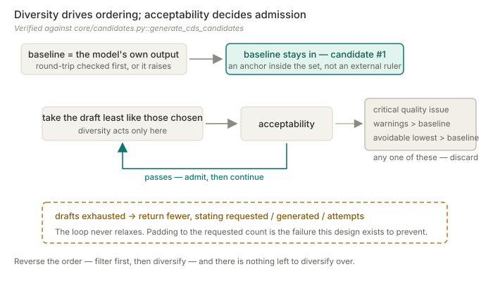

<div align="center">

# PichiaCLM

### Several codon sequences a lab can actually build — and that actually differ from each other.


[](https://github.com/owen-min/PichiaCLM-Torch)
[](#the-model)
[](#tech-stack)
[](tests)

[Attribution](#attribution) · [The model](#the-model) · [Method](#method-how-a-candidate-becomes-acceptable) · [Quick start](#quick-start) · [Tech stack](#tech-stack) · [Boundaries](#boundaries)

[**English**](README.md) · [中文](README.zh.md)

</div>

---

> Turns a protein sequence into several **synonymous CDS candidates that differ from each other**,
> each screened for sequence-level construction risk, and none of which is allowed to be worse than
> the baseline on the criteria that matter.

The "differ from each other" part is the whole point. A generator that returns five candidates which
are actually the same sequence has returned one candidate — and a wet lab cannot run that as five
constructs.

## Attribution

This repository is a fork of
[owen-min/PichiaCLM-Torch](https://github.com/owen-min/PichiaCLM-Torch).

**The Keras → PyTorch port of the model is not my work.** It is the upstream baseline, commit
`b6fea1b`. My contribution is everything after it: sequence safety analysis, constrained multi-
candidate generation, pairwise-diverse subset selection, the codon editor, and the three shared
interfaces. `git log` shows the split directly.

## The model

Not a Transformer — a **multi-task GRU Seq2Seq with scaled dot-product attention**
([`core/model.py`](Model_PichiaCLM/core/model.py)):

- bidirectional GRU encoder over the amino-acid sequence
- a GRU decoder emitting codons, plus a second GRU decoder reconstructing the amino-acid sequence
  as an auxiliary task — the reconstruction head is what keeps the codon head anchored to the
  protein it is supposed to encode
- scaled dot-product attention (`dot_product_attention`) between decoder state and encoder outputs

Weights ship in the repository (35.6 MB) and inference runs on CPU. No GPU, no download step —
for an internal lab tool, "clone it and it runs" beats a bigger model.

## Method: how a candidate becomes acceptable

Sampling synonymous codons is easy. Getting candidates a lab can actually build is where the work is.



**1 — Constrained generation.** Decoding is masked so only codons synonymous with the target residue
can be emitted. Translation identity is therefore structural, not something checked afterwards and
hoped for.

**2 — Sequence safety analysis** ([`core/analysis.py`](Model_PichiaCLM/core/analysis.py)). Every
candidate is screened for the failure modes that break synthesis and cloning rather than the ones
that look good in a metric:

| Check | Why it exists |
| --- | --- |
| `LocalGCWindow` | local GC extremes break synthesis even when global GC looks fine |
| `HomopolymerRun` | long single-base runs cause polymerase slippage |
| `TandemRepeat` · `RepeatedKmer` | repeats cause assembly misalignment |
| `MotifHit` | unintended restriction sites and regulatory motifs |
| `CAIComparison` | codon adaptation, computed against **two** reference frames |

Rare-codon runs are flagged per reference frame, and **not flagged at all for single-codon amino
acids** — there is no alternative to act on there, and an unactionable warning only dilutes the ones
that matter.

**3 — Two reference frames, neither used as a gate.** CAI is computed against both the training-set
codon frequencies and public Kazusa frequencies. They disagree, and that disagreement is
information — so both are reported next to each candidate and neither is a pass/fail threshold
([ADR-0001](docs/adr/ADR-0001-qualified-candidate-acceptance.md)). A single CAI cutoff would have
been simpler and would have hidden which reference frame the verdict came from.

**4 — Acceptance is relative to the baseline, not absolute.** A new candidate is accepted only if it
translates to the same protein, has no critical quality issue, carries **no more** risk warnings
than the baseline, and has **no more** avoidable lowest-preference codons than the baseline. A
candidate with a better CAI can still be rejected — buying a nicer score with added risk is the
trade this rule exists to block.

**5 — Diversity is selected for, not hoped for**
([`core/candidates.py`](Model_PichiaCLM/core/candidates.py)). `PairwiseDiversity` measures how far
apart candidates are at base-pair and codon level; `CandidateSubsetSelection` picks the subset that
maximises mutual difference. When the design space runs out, `CandidateSet.exhausted` is set and
**fewer candidates are returned** — the one thing that must never happen is padding the set with
near-duplicates to hit the requested count.

That last rule is the one worth defending in review: returning 3 when 5 were asked for is a visible,
correctable disappointment. Returning 5 that are secretly 3 wastes wet-lab weeks before anyone
notices.

## Quick start

```bash
git clone https://github.com/77652189/PichiaCLM-Torch.git
cd PichiaCLM-Torch
pip install -r requirements-streamlit.txt
```

```powershell
python -m streamlit run Model_PichiaCLM/interfaces/streamlit_app.py
```

No weights download and no GPU — inference runs on CPU against the checked-in weights.

Three interfaces share one core — Streamlit, CLI ([`interfaces/cli.py`](Model_PichiaCLM/interfaces/cli.py)),
and HTTP API ([`interfaces/api.py`](Model_PichiaCLM/interfaces/api.py)):

```bash
python -m Model_PichiaCLM.interfaces.cli --help
uvicorn Model_PichiaCLM.interfaces.api:app --port 8000   # pip install -r requirements-api.txt
```

ADR-0001 requires all three to surface the same generation and quality verdicts, so a candidate
cannot look acceptable in one entry point and unacceptable in another.

```bash
python -m pytest tests/     # 24 tests
```

## Tech stack

| Layer | Choice | Why this one |
| --- | --- | --- |
| Model | PyTorch, multi-task GRU Seq2Seq | Small enough to run on CPU with weights in the repository; the auxiliary reconstruction head constrains the codon head rather than saving parameters |
| Core dependency | **`torch` and nothing else** | `requirements-core.txt` is one line. Analysis, biology utilities and restriction scanning are standard library, so the scientific core carries no interface baggage |
| Interfaces | Streamlit · FastAPI · CLI | Split into `requirements-streamlit.txt` and `requirements-api.txt`, each layered on core — installing the UI does not pull in the web framework, or the reverse |
| Contracts | Pydantic | Request and result schemas at the API boundary |
| Tests | pytest over `unittest.TestCase` | 24 tests; a `FakePredictor` stands in for the model so the suite tests generation and screening logic rather than weights |

The dependency split is the layering made checkable: if `core/` ever imports Streamlit, installing
`requirements-core.txt` alone stops working.

## Boundaries

- **No yield prediction.** Candidates are screened for construction risk, not for expression level.
  A passing candidate is not a prediction of experimental success.
- **The port is upstream work** — see [Attribution](#attribution).
- **Not a Transformer.** GRU Seq2Seq with dot-product attention; saying otherwise is easy and wrong.
- **Codon preference statistics are descriptive.** They are shown for human comparison, not used as
  thresholds.
- **Fewer candidates than requested is a valid outcome**, and is reported explicitly.
- **Testing is the thinnest part.** 24 tests cover the invariants that fail silently, but there is
  no end-to-end regression against the real model.

## Documentation

| Document | Changes when |
| --- | --- |
| [Requirements](docs/REQUIREMENTS.md) | the goal or capability boundary changes |
| [Architecture](docs/ARCHITECTURE.md) | the implementation structure changes |
| [Execution plan](docs/EXECUTION_PLAN.md) | progress moves — sole authority on status |
| [Handoff](docs/HANDOFF.md) | the active slice changes |
| [ADR index](docs/adr/README.md) | never — decisions are superseded, not edited |

Deployment layout and interface split: [DEPLOYMENT.md](DEPLOYMENT.md).

---

<div align="center">

More work at [my personal site](https://77652189.github.io).

</div>
