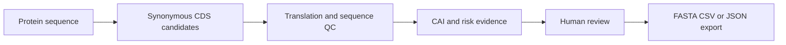
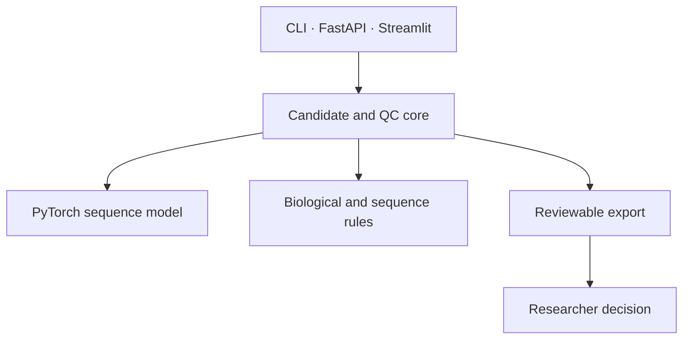

# PichiaCLM

[English](README.md) · [中文](README.zh.md) · [日本語](README.ja.md) · [한국어](README.ko.md)

> **Codon-design workbench for *Pichia* expression constructs.** It turns protein sequences into reviewable synonymous CDS candidates; it does not promise expression yield or experimental success.

## Why it matters

Construct design is often reduced to a single “optimized” DNA sequence. PichiaCLM keeps the alternatives, the sequence-quality evidence, and the human decision visible so that a research team can review a design before ordering DNA.

## What makes it strong

| Engineering decision | Interview-relevant value |
| --- | --- |
| Multiple candidates, not one opaque answer | Makes sequence trade-offs reviewable instead of hiding them behind a score |
| Dual CAI and rule-based QC | Separates codon preference evidence from translation, GC, repeat, motif, homopolymer, and restriction-site checks |
| One core behind CLI, HTTP, and Streamlit | Keeps programmatic and user-facing workflows consistent |
| Conservative acceptance rule | A candidate is a review input, never proof of secretion, yield, or wet-lab success |

## Workflow



## Architecture boundary



The interfaces may format and transport results; they must not redefine candidate acceptance. CAI is evidence for review, not an independent release threshold.

## Quick start

```powershell
pip install -r requirements.txt
python -m streamlit run Model_PichiaCLM/interfaces/streamlit_app.py
```

For an API service, run `uvicorn Model_PichiaCLM.interfaces.api:app --host 0.0.0.0 --port 8000`. Exported FASTA, CSV, and JSON remain inputs to human construct review.

## Engineering evidence

| Claim | How to verify | Guardrail |
| --- | --- | --- |
| Candidate and QC behavior | `python -m pytest -q tests/test_core_features.py` | Invalid inputs and critical sequence risks are explicit |
| Documentation boundary | `python -m pytest -q tests/test_docs_governance.py` | Product claims and current status stay in separate documents |

## Authoritative project documents

| Read this | For |
| --- | --- |
| [Requirements](docs/REQUIREMENTS.md) | Scope, non-goals, and acceptance |
| [Architecture](docs/ARCHITECTURE.md) | Layer boundaries and invariants |
| [Execution plan](docs/EXECUTION_PLAN.md) | Current authorization and stage gates |
| [Handoff](docs/HANDOFF.md) | Current slice and focused verification |
| [ADR index](docs/adr/README.md) | Long-lived design decisions |

<details>
<summary>Technical interview prompt: why not optimize only CAI?</summary>

CAI is useful comparative evidence, but it cannot capture all sequence risks or prove expression. PichiaCLM therefore keeps translation correctness and sequence-quality rules in the acceptance path, while exposing CAI from both training data and a public reference for review.
</details>

> **Reflection:** Good sequence design makes uncertainty inspectable before it becomes an expensive experiment. Explore more work at [my personal site](https://77652189.github.io).
