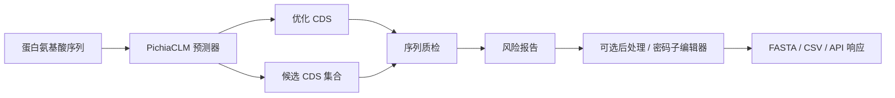
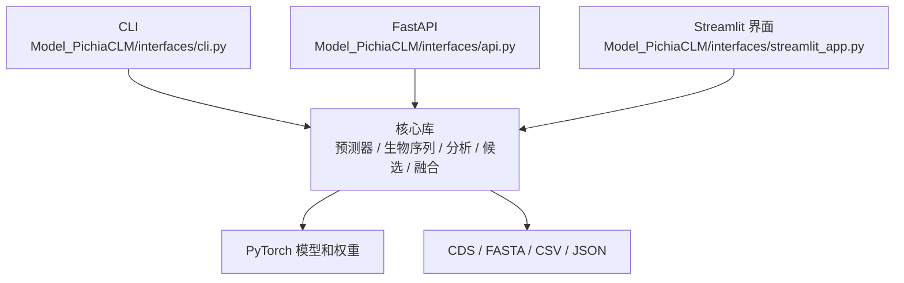

<div align="center">

# PichiaCLM-Torch

**面向毕赤酵母密码子优化、CDS 质检和构建设计复核的 PyTorch 工具包**

[](https://www.python.org/)
[](https://pytorch.org/)
[](https://fastapi.tiangolo.com/)
[](https://streamlit.io/)

**语言：** [英文](README.md) | 中文

</div>

---

## 项目简介

PichiaCLM-Torch 将蛋白质氨基酸序列转换为更适合 *Pichia pastoris*（毕赤酵母）表达的同义 CDS/DNA 候选，并提供部署接口和序列质检工具，用于克隆、合成或实验设计前的复核。

```text
氨基酸序列 -> 优化 CDS -> 质量报告 -> 构建设计复核表
```

本项目不设计新蛋白，也不预测表达产量。它优化密码子选择，并提示正式实验前需要人工复核的序列风险。

## 功能概览

| 方向 | 当前能力 |
|---|---|
| 模型推理 | 使用内置 PichiaCLM 权重执行 PyTorch AA-to-CDS 预测 |
| 批量处理 | 支持多蛋白、多变体或构建候选的 FASTA 批量预测 |
| 候选生成 | 生成多条 CDS 候选，比较序列差异，并选择低相似度子集 |
| CDS 质检 | 可分析外部软件优化后的 CDS，不重新运行预测 |
| 序列检查 | 翻译一致性、内部终止密码子、GC/局部 GC、CAI、密码子使用、稀有密码子连续段、同聚碱基、重复序列、motif 和限制性位点 |
| 构建复核 | 比较信号肽 + 成熟蛋白整体优化与分段优化 |
| 后处理 | 对部分限制性位点、motif、同聚碱基、高局部 GC 和重复片段做保守同义替换 |
| 接口 | CLI、FastAPI 和 Streamlit 共用同一套核心预测器 |

## 工作流程



在更完整的毕赤酵母表达设计流程中，SigScout 可以提供信号肽候选，P-PromOpt 可以提供启动子候选；PichiaCLM 聚焦 CDS 设计层。

## 架构概览



| 层级 | 关键路径 | 职责 |
|---|---|---|
| 核心层 | [`Model_PichiaCLM/core/`](Model_PichiaCLM/core/) | 模型加载、生物序列工具、CDS 质检、限制性位点扫描、候选生成、融合比较和后处理 |
| 接口层 | [`Model_PichiaCLM/interfaces/`](Model_PichiaCLM/interfaces/) | CLI、FastAPI 和 Streamlit 入口 |
| 模型文件 | [`Model_PichiaCLM/Training/`](Model_PichiaCLM/Training/) | 训练笔记本、数据、指标和内置权重 |
| 测试 | [`tests/test_core_features.py`](tests/test_core_features.py) | 生物序列工具、FASTA、分析、后处理、融合和候选生成的局部测试 |

部署说明见 [部署文档](DEPLOYMENT.md)。

## 快速开始

按需要安装依赖：

```powershell
pip install -r requirements-core.txt       # 仅核心推理
pip install -r requirements-api.txt        # FastAPI
pip install -r requirements-streamlit.txt  # Streamlit 界面
pip install -r requirements-deploy.txt     # API + UI
```

### CLI

单条预测：

```powershell
python -m Model_PichiaCLM.interfaces.cli --aa MSTNPKPQR --json
```

FASTA 批量预测：

```powershell
python -m Model_PichiaCLM.interfaces.cli `
  --aa-fasta input.fasta `
  --analysis `
  --out-fasta output_cds.fasta `
  --out-csv report.csv
```

分析外部优化 CDS：

```powershell
python -m Model_PichiaCLM.interfaces.cli `
  --cds ATGTCCACAAATCCCAAACCACAGAGA `
  --expected-aa MSTNPKPQR `
  --analysis
```

### FastAPI

```powershell
uvicorn Model_PichiaCLM.interfaces.api:app --host 0.0.0.0 --port 8000
```

示例请求：

```powershell
Invoke-RestMethod -Method Post `
  -Uri http://127.0.0.1:8000/predict `
  -ContentType application/json `
  -Body '{"amino_acids":"MSTNPKPQR"}'
```

主要接口：

| 接口 | 用途 |
|---|---|
| `GET /health` | 服务健康检查 |
| `POST /predict` | 单条 AA-to-CDS 预测 |
| `POST /predict_batch` | 批量 AA-to-CDS 预测 |
| `POST /predict_candidates` | 多候选 CDS 生成 |
| `POST /analyze_cds` | 外部 CDS 质检 |
| `POST /analyze_cds_batch` | 批量外部 CDS 质检 |

### Streamlit

```powershell
python -m streamlit run Model_PichiaCLM/interfaces/streamlit_app.py `
  --server.address 0.0.0.0 `
  --server.port 8501
```

打开：

```text
http://127.0.0.1:8501
```

页面包含单条预测、候选 CDS 生成、密码子编辑器、FASTA 批量预测、外部 CDS 质检和信号肽 / 成熟蛋白融合比较。

## 模型权重

默认权重路径：

```text
Model_PichiaCLM/Training/PichiaData/2Target_AllData/Arch1-0404.weights.pt
```

API 模式可通过环境变量覆盖：

```powershell
$env:PICHIA_CLM_WEIGHTS = "C:\path\to\Arch1-0404.weights.pt"
$env:PICHIA_CLM_DEVICE = "cpu"
```

`X`、`Z`、`B`、`U`、`O` 等模糊氨基酸默认会被拒绝，因为它们没有明确的生物学密码子掩码。

## 质量报告

分析报告包含：

| 类别 | 示例 |
|---|---|
| 翻译 | CDS 长度、阅读框、期望 AA 一致性、内部终止密码子 |
| 组成 | 全局 GC、30 bp 局部 GC 窗口、非法碱基 |
| 密码子使用 | 基于训练数据和公开 Kazusa *Pichia pastoris* 表的 CAI、密码子统计、稀有密码子连续段 |
| 可制造性 | 同聚碱基、串联重复、重复 12-mer、不想要的 motif |
| 克隆 | 默认和自定义限制性酶切位点 |
| 构建上下文 | 信号肽/成熟蛋白整体优化与分段优化比较 |

默认阈值：

```text
全局 GC: 35%-65%
局部 GC: 30 bp 窗口，25%-75%
默认酶切位点: EcoRI, XhoI, NotI, BamHI, HindIII, NdeI, NcoI, KpnI, XbaI, SpeI
```

## 项目结构

```text
PichiaCLM/
+-- Model_PichiaCLM/
|   +-- core/                     # 预测器、生物序列、分析、候选、融合、后处理
|   +-- interfaces/               # CLI、FastAPI、Streamlit
|   +-- Training/                 # 笔记本、数据、指标和权重
+-- tests/                        # 局部单元测试
+-- requirements-*.txt            # 拆分依赖
+-- DEPLOYMENT.md                 # 部署说明
```

## 测试

```powershell
python -m pytest -q tests/test_core_features.py
```

## 使用边界

- PichiaCLM 输出应视为候选优化 CDS，不是实验效果证明。
- 下单或实验前应复核翻译一致性、载体/克隆约束、合成公司规则和项目特定生物学要求。
- 信号肽和启动子选择不属于本仓库的预测目标，但输出可以与 SigScout 和 P-PromOpt 工作流衔接。

## 致谢

本仓库包含 PichiaCLM 风格密码子优化模型的 PyTorch 移植和部署层。原始 PichiaCLM 思路和数据处理脉络来自既有 PichiaCLM 研究代码与数据集。

## 许可证

当前仓库尚未声明开源许可证。对外复用、再分发或商业部署前，应先补充明确许可证。
