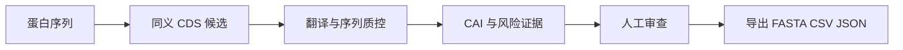
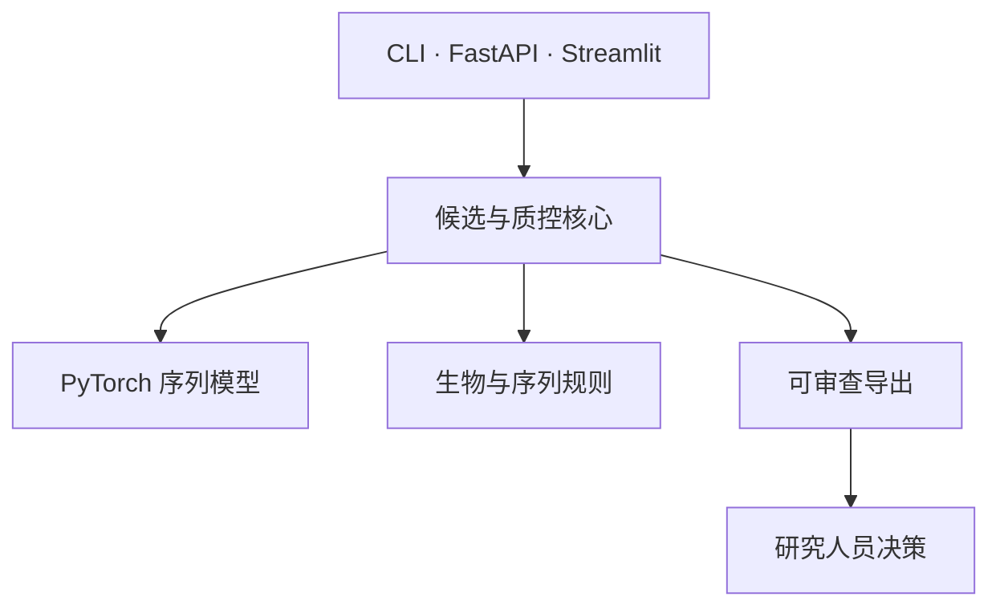

# PichiaCLM

[English](README.md) · [中文](README.zh.md) · [日本語](README.ja.md) · [한국어](README.ko.md)

> **面向毕赤酵母表达构建的密码子设计工作台。** 它把蛋白序列转为可审查的同义 CDS 候选；不承诺表达量或湿实验成功。

## 为什么重要

构建设计不应只交付一个无法解释的“最优”DNA 序列。PichiaCLM 保留候选、序列质量证据和人工判断，让团队在订购 DNA 前看清取舍。

## 面试展示亮点

| 工程判断 | 价值 |
| --- | --- |
| 输出多个候选，而非黑盒唯一答案 | 序列取舍可复核 |
| 双 CAI 与规则质控 | 区分密码子偏好证据与翻译、GC、重复、motif、同聚碱基、酶切位点风险 |
| CLI、HTTP、Streamlit 共用核心 | 自动化与人工流程结果一致 |
| 保守的候选判定 | 候选只服务审查，不被包装为分泌、产量或实验成功证明 |

## 工作流



## 架构边界



接口只能传递和展示结果，不能重定义候选合格规则；CAI 是审查证据，不是独立放行阈值。

## 快速开始

```powershell
pip install -r requirements.txt
python -m streamlit run Model_PichiaCLM/interfaces/streamlit_app.py
```

API 可使用 `uvicorn Model_PichiaCLM.interfaces.api:app --host 0.0.0.0 --port 8000` 启动。FASTA、CSV、JSON 导出物仍须人工复核。

## 工程证据

| 主张 | 验证方式 | 护栏 |
| --- | --- | --- |
| 候选与质控行为 | `python -m pytest -q tests/test_core_features.py` | 无效输入与关键序列风险显式呈现 |
| 文档边界 | `python -m pytest -q tests/test_docs_governance.py` | 产品主张与当前状态分离 |

## 权威文档

| 文档 | 用途 |
| --- | --- |
| [需求](docs/REQUIREMENTS.md) | 范围、非目标、验收 |
| [架构](docs/ARCHITECTURE.md) | 分层边界与不变量 |
| [执行计划](docs/EXECUTION_PLAN.md) | 当前授权与阶段门禁 |
| [交接](docs/HANDOFF.md) | 当前切片与聚焦验证 |
| [ADR 索引](docs/adr/README.md) | 长期设计取舍 |

<details>
<summary>技术追问：为什么不只优化 CAI？</summary>

CAI 是有用的比较证据，却不能覆盖全部序列风险，更不能证明表达。PichiaCLM 因而把翻译正确性和序列质量规则放在判定路径中，并同时展示训练数据与公开参考的 CAI。
</details>

> **项目思考：** 好的序列设计，是在昂贵实验开始前让不确定性可被检查。更多项目见[个人网站](https://77652189.github.io)。
