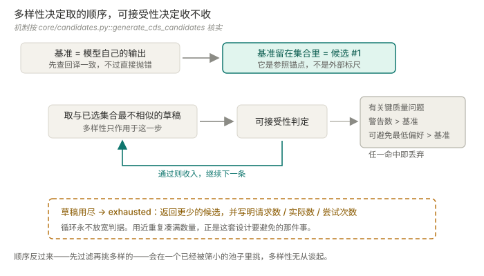

<div align="center">

# PichiaCLM

### 几条实验室真能造出来、而且彼此确实不同的密码子序列。


[](https://github.com/owen-min/PichiaCLM-Torch)
[](#模型)
[](#技术栈)
[](tests)

[归属](#归属) · [模型](#模型) · [方法](#方法一个候选如何变得可接受) · [快速开始](#快速开始) · [技术栈](#技术栈) · [边界](#边界)

[English](README.md) · [**中文**](README.zh.md)

</div>

---

> 把一条蛋白序列变成若干条**彼此互不相同**的同义 CDS 候选，
> 每条都过序列级施工风险筛查，且在关键判据上都不允许比基准更差。

"彼此互不相同"是全部要点。一个返回五条实为同一序列的生成器，等于只返回了一条——
而湿实验没法把它当五个构建体去做。

## 归属

本仓库 fork 自
[owen-min/PichiaCLM-Torch](https://github.com/owen-min/PichiaCLM-Torch)。

**Keras → PyTorch 的模型移植不是本人的工作。** 它是上游基线，commit `b6fea1b`。
本人的贡献是它之后的全部：序列安全分析、受约束的多候选生成、两两互异的子集选择、
密码子编辑器，以及三个共享同一核心的接口。`git log` 能直接看出这条分界。

## 模型

**不是 Transformer**，是**多任务 GRU Seq2Seq + 缩放点积注意力**
（[`core/model.py`](Model_PichiaCLM/core/model.py)）：

- 双向 GRU 编码器读入氨基酸序列
- 一个 GRU 解码器输出密码子；另一个 GRU 解码器把氨基酸序列重建出来作为**辅助任务**——
  这个重建头的作用是**把密码子头锚定在它本该编码的那个蛋白上**
- 解码器状态与编码器输出之间做缩放点积注意力（`dot_product_attention`）

权重随仓库分发（35.6 MB），CPU 推理。无需 GPU、无需下载步骤——
对实验室内部工具来说，**"clone 完就能跑"比模型更强更重要**。

## 方法：一个候选如何变得"可接受"

采样同义密码子很容易。让候选**实验室真能造出来**才是工作量所在。



**1 — 受约束的生成。** 解码时做了掩码，只允许发出与目标残基同义的密码子。
翻译一致性因此是**结构性的**，不是事后检查再祈祷。

**2 — 序列安全分析**（[`core/analysis.py`](Model_PichiaCLM/core/analysis.py)）。
每条候选都按**真正会导致合成与克隆失败的模式**筛查，而不是按好看的指标：

| 检查 | 为什么存在 |
| --- | --- |
| `LocalGCWindow` | 全局 GC 正常时，局部 GC 极值照样让合成失败 |
| `HomopolymerRun` | 长单碱基重复导致聚合酶打滑 |
| `TandemRepeat` · `RepeatedKmer` | 重复序列导致组装错位 |
| `MotifHit` | 意外的酶切位点与调控基序 |
| `CAIComparison` | 密码子适应度，在**两套**参照系下各算一遍 |

稀有密码子连续段按参照系分别标注，且**只有一个密码子的氨基酸完全不标**——
那里没有可选项，不可行动的告警只会稀释真正要紧的那些。

**3 — 两套参照系，且都不作闸。** CAI 同时对训练集频率与公开 Kazusa 频率计算。
**它们会不一致，而这个不一致本身是信息**——所以两个值并排列在候选旁边，
谁也不是通过/失败的门槛（[ADR-0001](docs/adr/ADR-0001-qualified-candidate-acceptance.md)）。
单一 CAI 阈值会更简单，代价是掩盖掉"这个判定来自哪个参照系"。

**4 — 可接受性相对基准，不是绝对阈值。** 一条新候选被接受，必须：回译为同一蛋白、
无关键质量问题、风险警告数**不高于**基准、可避免的最低偏好密码子数**不高于**基准。
一条 CAI 更好的候选仍可能被拒——**用更高风险买一个更好看的分数**，正是这条规则要堵的交易。

**5 — 多样性是选出来的，不是碰出来的**
（[`core/candidates.py`](Model_PichiaCLM/core/candidates.py)）。
`PairwiseDiversity` 在碱基与密码子层面度量候选间距离，`CandidateSubsetSelection`
挑互相差异最大的子集。设计空间耗尽时置位 `CandidateSet.exhausted` 并**返回更少的候选**——
绝不允许发生的是用近重复凑满请求数。

最后这条最值得在评审里守住：**请求 5 条返回 3 条，是可见、可纠正的失望；
返回 5 条实为 3 条，会在没人察觉的情况下浪费掉几周湿实验。**

## 快速开始

```bash
git clone https://github.com/77652189/PichiaCLM-Torch.git
cd PichiaCLM-Torch
pip install -r requirements-streamlit.txt
```

```powershell
python -m streamlit run Model_PichiaCLM/interfaces/streamlit_app.py
```

不需要下载权重，也不需要 GPU——直接用仓库里的权重在 CPU 上推理。

三个接口共用一个核心——Streamlit、CLI（[`interfaces/cli.py`](Model_PichiaCLM/interfaces/cli.py)）、
HTTP API（[`interfaces/api.py`](Model_PichiaCLM/interfaces/api.py)）：

```bash
python -m Model_PichiaCLM.interfaces.cli --help
uvicorn Model_PichiaCLM.interfaces.api:app --port 8000   # pip install -r requirements-api.txt
```

ADR-0001 要求三者呈现**同一套**生成与质量判定结果，
所以一条候选不能在某个入口看起来合格、在另一个入口看起来不合格。

```bash
python -m pytest tests/     # 24 个测试
```

## 技术栈

| 层 | 选型 | 为什么是它 |
| --- | --- | --- |
| 模型 | PyTorch，多任务 GRU Seq2Seq | 小到可以 CPU 推理且权重随仓库；辅助重建头的作用是**约束密码子头**，不是省参数 |
| 核心依赖 | **只有 `torch`** | `requirements-core.txt` 只有一行。分析、生物学工具、酶切扫描全是标准库——科学核心不背任何界面包袱 |
| 接口 | Streamlit · FastAPI · CLI | 拆成 `requirements-streamlit.txt` 与 `requirements-api.txt`，各自叠在 core 之上——装界面不会拖进 Web 框架，反之亦然 |
| 契约 | Pydantic | API 边界上的请求与结果 schema |
| 测试 | pytest 跑 `unittest.TestCase` | 24 个测试；用 `FakePredictor` 替身，使套件测的是生成与筛查逻辑而不是权重 |

**依赖拆分是把分层变成可检验的**：如果哪天 `core/` 导入了 Streamlit，
单装 `requirements-core.txt` 就会立刻不能用。

## 边界

- **不预测产量。** 筛查的是施工风险，不是表达水平。通过筛查**不是**实验会成功的预测。
- **移植是上游工作** —— 见[归属](#归属)。
- **不是 Transformer。** 是 GRU Seq2Seq 加点积注意力；说反了很容易，也很容易被拆穿。
- **密码子偏好统计是描述性的**，供人工比较，不作阈值。
- **候选数少于请求数是合法结果**，且会被显式报告。
- **测试是最薄的一环。** 24 个测试覆盖了那些"错了不报错"的不变量，
  但没有针对真实模型的端到端回归。

## 文档

| 文档 | 什么时候改 |
| --- | --- |
| [需求](docs/REQUIREMENTS.md) | 目标或能力边界变了 |
| [架构](docs/ARCHITECTURE.md) | 实现结构变了 |
| [执行计划](docs/EXECUTION_PLAN.md) | 进度推进了——状态的唯一权威 |
| [handoff](docs/HANDOFF.md) | 当前切片换了 |
| [ADR 索引](docs/adr/README.md) | 从不改——决策只被取代，不被改写 |

部署布局与接口拆分见 [DEPLOYMENT.md](DEPLOYMENT.md)。

---

<div align="center">

更多项目见[个人网站](https://77652189.github.io)。

</div>
